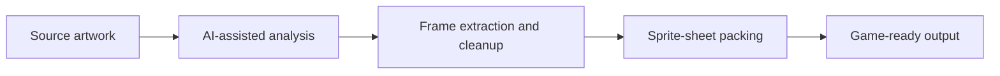

# AI Sprite Sheet Converter

> A work-in-progress project space for AI-assisted sprite-sheet conversion.

The goal is to make it easier for game creators to turn source artwork into clean, game-ready sprite sheets while preserving transparency, consistency, and predictable output dimensions.

## Project status

This repository is in the early documentation and planning phase. No runnable implementation or demo has been published yet, so there are no screenshots or installation instructions to share at this time.

## Intended workflow

## What the project aims to solve

- Identify and isolate individual frames from source artwork
- Normalize dimensions, transparency, and spacing
- Generate packed sprite sheets and usable metadata
- Reduce repetitive art-preparation work for small game teams

## Planned direction

1. Publish a small, reproducible conversion prototype.
2. Add example inputs and generated outputs.
3. Document the local setup and conversion workflow.
4. Add visual examples once the first working demo is available.

## Note for collaborators

This is an early project. The README describes the intended product direction rather than a released tool.
